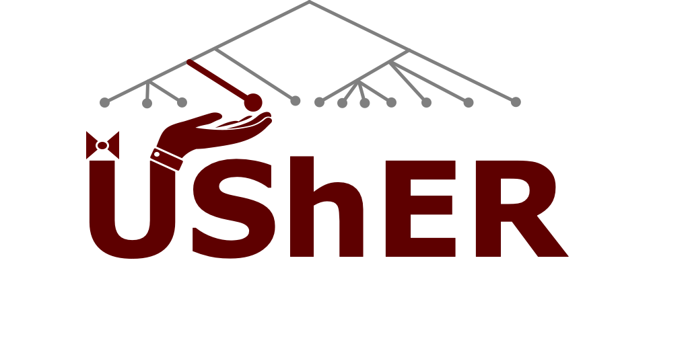
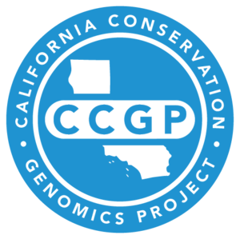

# Research Interests
  
Research in the lab focuses on a broad range of questions in evolutionary genomics. Much of our work is at the interface of genomics, evolutionary biology, statistics and computer science. We are always looking for new fun problems and a few of our recent research thrusts are below. 
 
## SARS-CoV-2 Phylogenomics
  
  Our group has a strong focus on tool development and applications for SARS-CoV-2 phylogenomics. This work is based in large part on a powerful mutation annotated tree datastructure that allows one to "save" and "load" phylogenetic analyses and raidly switch from inference to optimization. Utilities we developed include [phylogenetic placement](https://www.nature.com/articles/s41588-021-00862-7){:target="_blank"}, [tree manipulation](https://academic.oup.com/mbe/advance-article/doi/10.1093/molbev/msab264/6361626){:target="_blank"}, and [recombination detection](https://www.biorxiv.org/content/10.1101/2021.08.04.455157v1){:target="_blank"}. We also maintain a [freely-available repository](http://hgdownload.soe.ucsc.edu/goldenPath/wuhCor1/UShER_SARS-CoV-2/){:target="_blank"} of mutation annotated trees built on public data. We're currently working on additional optimizations of our tools and the tree structure, developing downstream applications, and extending these tools and downstream analyses to new vial and bacterial pathogens. 
  

  
## Admixture and Epistasis 
  
Our group has a longstanding interest in understanding the evolutionary consequences of admixture--a process where two or more genetically distinct populations exchange genes. We have developed an efficient forward-in-time simulation method, [SELAM](https://academic.oup.com/bioinformatics/article/32/19/3035/2196613){:target="_blank"} as well as a suite of methods for [inferring the landscape of mosaic ancestry in admixed populations](https://journals.plos.org/plosgenetics/article?id=10.1371/journal.pgen.1006529){:target="_blank"} and fitting population genetic modeles of [complex admixture](https://academic.oup.com/genetics/article/210/3/1089/5931071){:target="_blank"} and [natural selection during admixture](https://academic.oup.com/mbe/article/38/5/2152/6120794){:target="_blank"}. 
  
## Conservation Genomics and the California Conservation Genomics Projects

Researchers in our group lead the informatics for the [California Conservation Genomics Project](https://www.ccgproject.org/){:target="_blank"}; the largest and most comprehensive conservation genomics project to date. Members of the CCGP have collected samples for 230 carefully selected species to generate whole-genome data of nearly 20,000 individuals. Our group is in charge of generating fully reproducable pipelines to process and analyze petabytes of sequencing data. These products will be used to inform conservation decisions and address outstanding challenges in the field of evolutionary landscape genomics. Research in this area is ongoing, check back soon for updates!

{:target="_blank"}

## Genome Structure Evolution

We have longstanding inetrest and expertise in genome structure evolution, with a particular emphasis on genome inversions and intron evolution. Our group has develope approaches to detect inversions [using short read data in Drosophila melanogaster](https://academic.oup.com/genetics/article/192/1/131/5935022){:target="_blank"} and [proximity ligation data in mosquito malaria vector species](https://academic.oup.com/genetics/article/213/4/1495/5930630){:target="_blank"}. More recently, we created synthetic chromosomal invertsions to closely mimic natural inversions. [We used these synthetic inversions to show that genome structure has a nearly negligible effect on gene expression while natural inversions are associated with mutations that have widespread impacts](https://www.pnas.org/content/115/21/5492.short){:target="_blank"}. Much of our experimental work has been curtailed due to the pandemic but we are interested in re-opening this line of investigation! 
